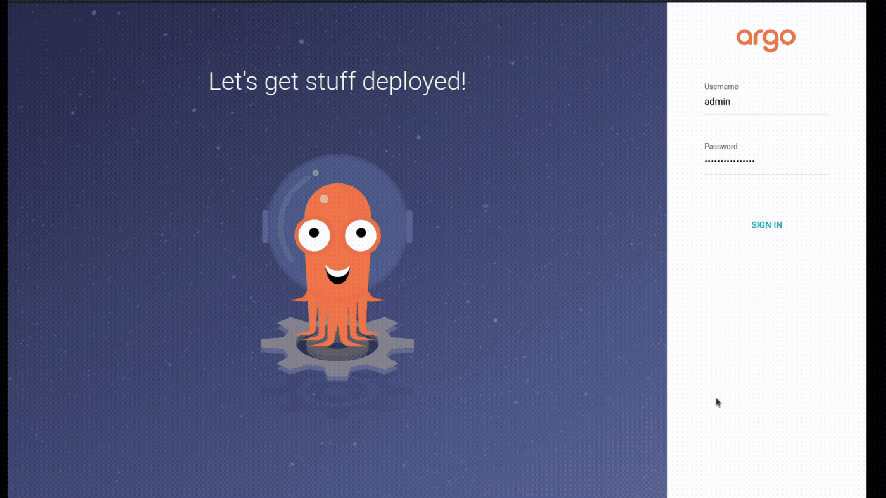

# AsciiArtify – Minimum Viable Product (MVP)

## GitOps Application Deployment with ArgoCD

### Objective

The purpose of this MVP is to demonstrate a complete GitOps workflow using ArgoCD on Kubernetes.

Following the successful completion of the Concept and Proof of Concept (PoC) phases, the MVP validates that application deployment and synchronization can be managed automatically through ArgoCD.

The goal is to demonstrate that:

* Kubernetes is operational and ready to host workloads.
* ArgoCD can manage application deployments.
* Application definitions stored in Git can be synchronized automatically.
* The deployed application state in Kubernetes matches the desired state stored in Git.

---

## Technology Stack

| Component  | Purpose                                       |
| ---------- | --------------------------------------------- |
| k3d        | Lightweight Kubernetes cluster                |
| Kubernetes | Container orchestration platform              |
| Docker     | Container runtime                             |
| ArgoCD     | GitOps continuous delivery platform           |
| GitHub     | Source of truth for application configuration |

---

## GitOps Workflow

```text
Developer
    |
    | Commit / Push
    v
Git Repository
    |
    | Monitored by ArgoCD
    v
ArgoCD
    |
    | Synchronization
    v
Kubernetes Cluster
    |
    v
Running Application
```

In a GitOps workflow, the Git repository acts as the single source of truth. ArgoCD continuously monitors the repository and reconciles the Kubernetes cluster state with the desired configuration stored in Git.

---

## Demo Application Repository

For demonstration purposes, the following repository was used:

https://github.com/den-vasyliev/go-demo-app

The same workflow can be applied to any application repository containing Kubernetes manifests or Helm charts.

---

## Demonstration

The MVP demonstration consists of three stages.

### 1. Cluster Validation


Demonstrates:

* Kubernetes cluster availability
* ArgoCD components running successfully
* Environment readiness for deployment

---

### 2. Create Application in ArgoCD




Demonstrates:

* Creating an ArgoCD Application
* Connecting the application to the Git repository
* Configuring the synchronization target
* Initiating the synchronization process

---

### 3. Verify Deployment After Synchronization


Demonstrates:

* Successful synchronization status
* Application deployment to Kubernetes
* Healthy application state reported by ArgoCD
* Running workloads in the cluster

---

## Expected Result

After synchronization:

* ArgoCD reports the application as **Healthy**
* ArgoCD reports the application as **Synced**
* Kubernetes resources are created automatically
* The cluster state matches the configuration stored in Git

---

## Result

The MVP was completed successfully.

The following objectives were achieved:

* Kubernetes cluster deployed and operational
* ArgoCD installed and configured
* Git repository connected to ArgoCD
* Application synchronized automatically
* Deployment verified in Kubernetes

This MVP demonstrates that the selected GitOps approach is technically viable and ready to support future AsciiArtify application deployments.

---

## Repository

Repository URL:

```text
https://github.com/lutska/AsciiArtify
```
