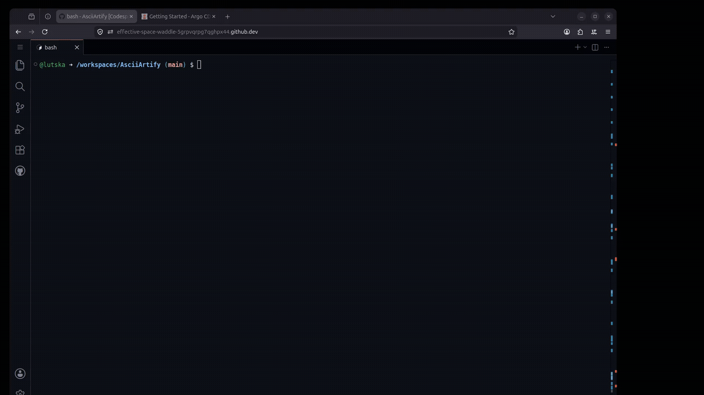

# AsciiArtify – Proof of Concept (PoC)

## Deploying ArgoCD on Kubernetes using k3d

### Objective

The purpose of this Proof of Concept (PoC) is to validate the technical feasibility of deploying a GitOps platform for the AsciiArtify project.

Based on the evaluation performed during the Concept phase, **k3d** was selected as the Kubernetes distribution for local development and testing, while **ArgoCD** was chosen as the GitOps platform.

Official ArgoCD documentation:
https://argo-cd.readthedocs.io/en/stable/

This PoC demonstrates that:

* A Kubernetes cluster can be provisioned successfully.
* ArgoCD can be installed and configured on the cluster.
* Team members can access the ArgoCD web interface.
* The environment is ready for MVP development and future GitOps workflows.

---

## Technology Stack

| Component  | Purpose                                          |
| ---------- | ------------------------------------------------ |
| k3d        | Lightweight Kubernetes cluster running in Docker |
| Kubernetes | Container orchestration platform                 |
| Docker     | Container runtime                                |
| ArgoCD     | GitOps continuous delivery platform              |

---
## Deployment Procedure

### Common Installation Steps

#### 1. Create Kubernetes Cluster

```bash
k3d cluster create argocd
```

#### 2. Verify Cluster Status

```bash
kubectl cluster-info
kubectl get nodes
```

#### 3. Create ArgoCD Namespace

```bash
kubectl create namespace argocd
```

#### 4. Install ArgoCD  (https://argo-cd.readthedocs.io/en/stable/getting_started/)

```bash
kubectl apply -n argocd \
  --server-side \
  --force-conflicts \
  -f https://raw.githubusercontent.com/argoproj/argo-cd/stable/manifests/install.yaml
```

#### 5. Verify Installation

```bash
kubectl get pods -n argocd
```

All ArgoCD components should be in the `Running` state before proceeding.

---

### Option 1 – Local Environment

#### Expose the ArgoCD Server

```bash
kubectl port-forward svc/argocd-server -n argocd 8080:443
```

#### Retrieve Initial Administrator Password

```bash
kubectl -n argocd get secret argocd-initial-admin-secret \
  -o jsonpath="{.data.password}" | base64 -d
```

#### Access the Web Interface

Open the following URL in a browser:

```text
https://localhost:8080
```

Login using:

```text
Username: admin
Password: <retrieved from previous command>
```

---

### Option 2 – GitHub Codespaces

GitHub Codespaces exposes forwarded ports through a public HTTPS endpoint. To simplify access, ArgoCD can be configured to run in insecure mode and rely on the Codespaces HTTPS proxy.

#### Configure ArgoCD

```bash
kubectl patch configmap argocd-cmd-params-cm -n argocd \
  --type merge \
  -p '{"data":{"server.insecure":"true"}}'
```

Restart the ArgoCD server:

```bash
kubectl rollout restart deployment argocd-server -n argocd
kubectl rollout status deployment argocd-server -n argocd
```

#### Forward the ArgoCD Service

```bash
kubectl port-forward svc/argocd-server -n argocd 8080:443
```

#### Expose the Port

```bash
gh codespace ports visibility 8080:public
```

Check the ports and URL 

```bash
gh codespace ports
```
The URL to access ArgoCD Web Interface will be similar to:

```text
https://<codespace-name>-8080.app.github.dev
```

#### Retrieve Initial Administrator Password

```bash
kubectl -n argocd get secret argocd-initial-admin-secret \
  -o jsonpath="{.data.password}" | base64 -d
```


#### Access the Web Interface

Login using:

```text
Username: admin
Password: <retrieved from previous command>
```

---

## Demonstration

Below is a demonstration of the deployment and configuration process on GitHub Codespaces 



The recording demonstrates:

1. Kubernetes cluster creation and verification.
2. ArgoCD installation validation.
3. Access to the ArgoCD web interface.
4. Successful authentication using the initial administrator account.

---

## Result

The Proof of Concept was completed successfully.

The following objectives were achieved:

* Kubernetes cluster deployed using k3d.
* ArgoCD installed and operational.
* Web interface accessible to team members.
* Environment prepared for future GitOps workflows and MVP implementation.

This confirms the feasibility of using ArgoCD as the GitOps platform for the AsciiArtify project.

---

## Repository

Repository URL:

```text
https://github.com/lutska/AsciiArtify
```
